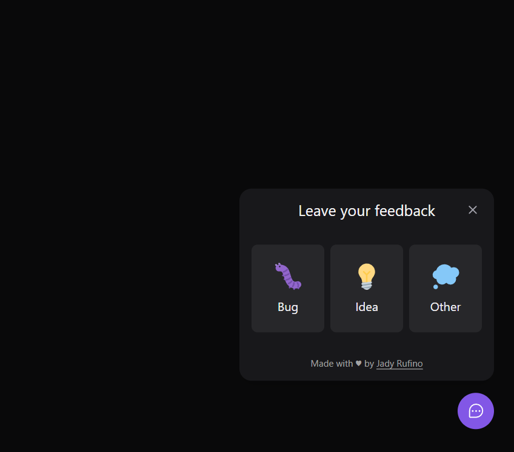
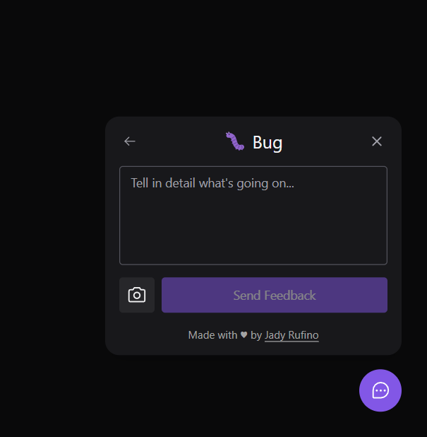
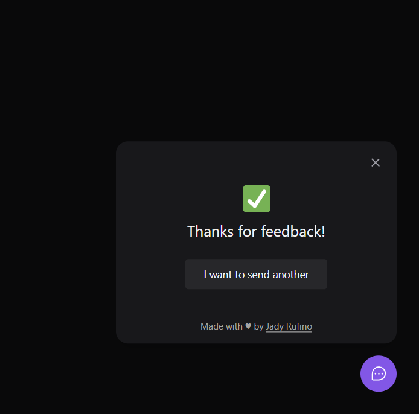

<h1 align="center">
   
</h1>

 

##  Layout 🖌️

Check layout in the link below:

- [Layout Web](https://www.figma.com/community/file/1102912516166573468/Feedback-Widget)

 

## Showcase 📸

  
  
  

## Technologies 👨‍💻

This project has been created with the following technologies:

- [React](https://reactjs.org)
- [Tailwindcss](https://tailwindcss.com)
- [Vite](https://vitejs.dev)
- [TypeScript](https://www.typescriptlang.org)
- [Express](https://expressjs.com/pt-br)
- [Prisma](https://www.prisma.io)
- [Jest](https://jestjs.io)
- [React Native](https://reactnative.dev/)
- [Expo](https://expo.dev/)

Made with  💜 by Jady Rufino
